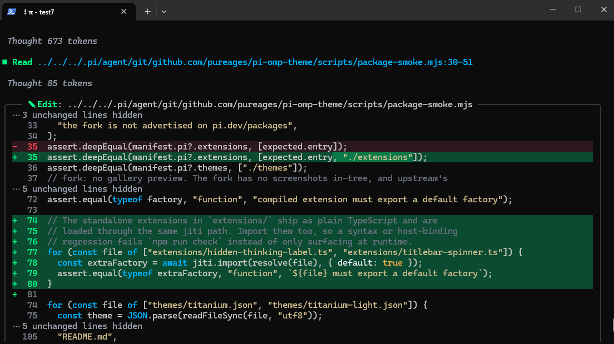
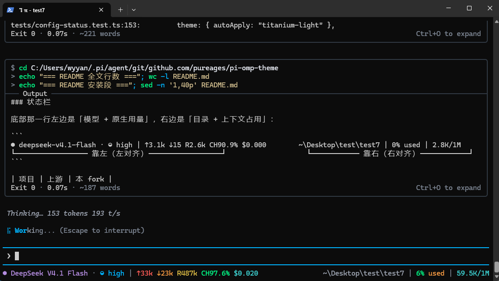

# pi-omp-theme（pureages fork）

给 [pi](https://github.com/earendil-works/pi) 用的主题 + TUI 呈现扩展。这是
[QuangThai/pi-omp-theme](https://github.com/QuangThai/pi-omp-theme)（MIT）的**个人 fork**。

- 版本线：`1.1.0-fork.N`。上游最后合并的是 `1.0.12`，后续 fork 改动都带 `-fork.N` 后缀，
  和上游发布区分开。改动明细见 [CHANGELOG.md](CHANGELOG.md)。
- 运行时：Node.js ≥ 22.19，pi ≥ 0.83（每次渲染都会探测运行时接口，认不出来就回退官方原生渲染）

## 界面

（1）oh-my-pi的主题比起原生pi确实没得说，所有布局模块分明，看着很舒服。



（2）我增加了每次正在思考的toke/s的统计显示。最下面的状态栏魔改增加了五颜六色。大部分我仍然习惯沿用原生官方pi的内容。



## 安装


### 方式 A、用 pi install git 安装

```bash
pi install git:github.com/pureages/pi-omp-theme
```

### 方式 B：没有 git → 下载 本仓库.ZIP + 本地路径安装


**Windows（PowerShell，一行一行复制执行）：**

```powershell
# 1) 下载最新 main 的 ZIP
Invoke-WebRequest -Uri "https://github.com/pureages/pi-omp-theme/archive/refs/heads/main.zip" -OutFile "$env:TEMP\pi-omp-theme.zip"

# 2) 解压到家目录并改名成 pi-omp-theme（先删旧目录，方便原地重新下载更新）
Remove-Item -Recurse -Force "$HOME\pi-omp-theme" -ErrorAction SilentlyContinue
Expand-Archive -Path "$env:TEMP\pi-omp-theme.zip" -DestinationPath $HOME -Force
Move-Item "$HOME\pi-omp-theme-main" "$HOME\pi-omp-theme"

# 3) 安装
pi install "$HOME\pi-omp-theme"
```

**macOS / Linux（bash）：**

```bash
# 1)+2) 下载 tar.gz，解压到家目录并改名成 pi-omp-theme
curl -L -o /tmp/pi-omp-theme.tar.gz https://github.com/pureages/pi-omp-theme/archive/refs/heads/main.tar.gz
rm -rf ~/pi-omp-theme && tar -xzf /tmp/pi-omp-theme.tar.gz -C ~ && mv ~/pi-omp-theme-main ~/pi-omp-theme

# 3) 安装
pi install ~/pi-omp-theme
```


## 许可

MIT，见 [LICENSE](LICENSE)。上游版权归 QuangThai；本 fork 的修改同样以 MIT 发布。

改动记录见 [CHANGELOG.md](CHANGELOG.md)：最上面是 fork 自己的版本线
（`1.1.0-fork.2`，基于最后合并的上游版本 `1.0.12`），下面全是上游历史，原样保留。
